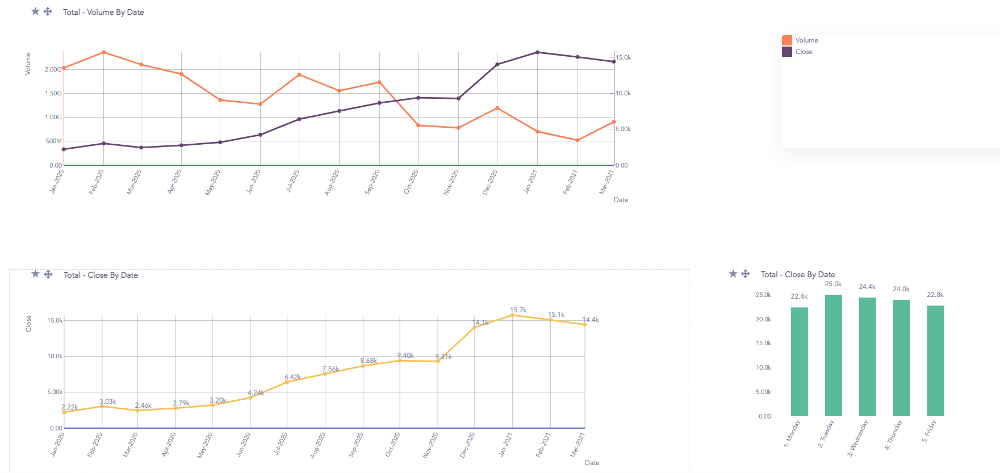

# Data Science eksamensprojekt

## Stock Exchange System

 

- Claus Kramath - cph-ck83@cphbusiness.dk
- Jörg Oertel - cph-jo130@cphbusiness.dk
- Mads Wulff Nielsen - cph-mn492@cphbusiness.dk

 

## Projektet

Vi vil lave en applikation, der kan forudsige en given kurs på en aktie, et råstof eller valuta. Projektet vil bestå af forskellige moduler, der kommunikerer indbyrdes for at give det bedst mulige resultat. Projektet skal give brugeren en samlet anbefaling omkring køb og salg af værdipapirer. Vi mener at Data Science i høj grad giver mening at bruge i denne sammenhæng, da vi taler om at kunne forudsige et resultat ud fra en historiske data. Vores motivation for at bygge projektet er, at kunne tilbyde små investorer en mulighed for at handle bedre på diverse markeder.

## Hypotese

Kan vi forudsige en aktie i et givet tidsinterval med rimelig sikkerhed?

 

## Projektets opbygning

### **Stock predicter**

Dette modul vil have ansvaret for at processere historiske data og ud fra dette give et bud på udviklingen i kursen.
\
\
Mulige teknologier

- Lineær Regression
- LSTM, Long Short Term Memory - RNN, Recurrent Neural Network
- Python

Mulige datakilder

- Alpha Vantage
- Yahoo Finance

 

### **Scraper**

Baseret på brugerens interesse i aktiemarkedet, vil der kunne indtastes søgekriterier for at kunne finde relevante artikler om emnet. Er brugeren interesseret i Tesla aktien, kunne det være relevant at finde artikler omkring Elon Musk, Lithiumbatterier eller SpaceX. Disse artikler scrapes fra forskellige kilder på internettet og gemmes i en database for videre processering.
\
\
Mulige teknologier

- Neo4j
- HBase
- Python

Mulige datakilder

- Twitter
- Wall Street Journal
- Investors
- CNBC
- MarketWatch

 

### **Sentiment Analyzer**

Dette modul vil i samspil med scraper modulet analysere artikler og give en procent score på positiv, negativ eller neutral tone i artiklerne. På den måde kan vi afgøre om der er meget negativ eller positiv omtale omkring eksempelvis Tesla og om det kan have en betydning for aktienværdien.
\
\
Mulige teknologier

- NLP, Natural Language Processing - Kap. 21, Joel Grus
- Python

Mulige datakilder

- Egen database over scraper resultater

 

### **Autotrader**

Vil være et nice to have modul og have den laveste prioritet gennem projektet. Modulet er tiltænkt at håndterer handel med aktier via et API. Når applikationen er kommet frem til en anbefaling omkring en aktie, vil autotraderen enten købe eller sælge på baggrund af denne anbefaling.
\
\
Mulige teknologier

- Alpaca API
- Python

 

### **Dashboard**

Vi har fremstillet et dashboard for at eksemplificere en visuel repræsentation af data. Dashboard'et er udarbejdet i jetpackdata, se afsnittet 'Links'.

### **Links**

- [docker metabase](https://hub.docker.com/r/metabase/metabase)
- [eksempler på github](https://github.com/huseinzol05/Stock-Prediction-Models#models)
- [jetpack data](https://jetpackdata.com)
