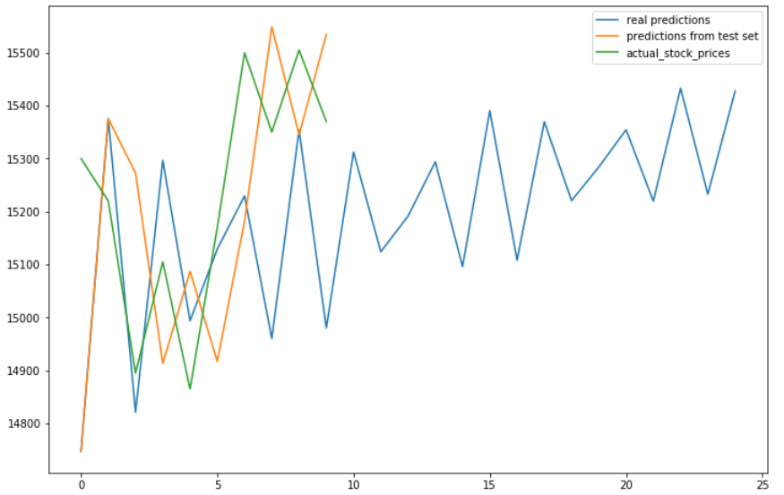

# Data story for aktie software.

## 1. Aktieudvikling

Den generelle tendens i aktiers kursudvikling er stigende. Undertiden sker der dog hændelser, som påvirker aktiekurser ekstraordinært. Eksempelvis Black Tuesday i 1929 og Black Monday i 1987.

Også langt mindre hændelser kan have stor betydning. Eksempelvis faldt Coca-Cola aktien markant efter fodboldstjernen Ronaldo fjernede 2 af EM-2020 hovedsponsorens flasker fra bordet under en pressekonference med det portugisiske landshold d. 14/6 2021.

## 2. Aktier i grøn økonomi

Globale omstændigheder kan påvirke kursudviklingen på aktier i berørte sektorer. Vor tids klimaudfordringer, er bl.a. med til at bestemme kursudviklingen på aktier i den 'grønne' økonomi. Også når politiske vinde vender, påvirkes aktier.

https://www.tradingview.com/chart/VWSYF/hx8CYkPb-VESTAS-to-benefit-from-Biden-s-victory/

## 3. Online trends kan også påvirke markedet

Et stadig stigende antal medier danner beslutningsgrundlag for aktiehandlere. Trends i disse medier afspejles også i aktiekurser.

https://www.theguardian.com/technology/2021/may/12/elon-musk-tesla-bitcoin

https://theirrelevantinvestor.com/2020/07/28/does-the-media-affect-the-stock-market/

## 4. Forudsigelse af aktiekurs på baggrund af empiri og trends

Vores hypotese siger, at vi kan lære en maskine at forudsige aktiekurser, ved at fodre den med tidligere kurser. Dette kaldes machine learning.

Machine Learning er en form for kunstig intelligens, hvor en maskine lærer sig at beregne udfaldet af en given omstændighed, baseret på tidligere erfaringer.

### 4.1 Neurale netværk

En teknologi der ofte bruges ifm. genkendelse af mønstre, er neurale netværk.

Man prøver at simulere den menneskelige hjernes neuroner og således få maskinen til at 'huske', hvad der skal ske hvornår.

Når vi forudsiger aktiekursen 1 dag frem i tiden, kan vi derfor gøre det, med en rimelig sikkerhed.

Det viser sig dog, at når vi forsøger at forudsige længere ud i fremtiden, kommer LSTM til kort.

Vi tolker LSTM grafen som værende et resultat af, at maskinen har lært sig tendenser i kursudviklingen i et tidsrum, hvor aktiekursen overordnet faldt.

### 4.2 Lineær regression

Denne teknologi forsøger at ramme ideallinjen gennem punkter, så man kan opstille en ligning, der bedst beskriver punkternes formel.

Med denne teknologi ser vi en bedre nøjagtighed i forudsigelse af aktiekursen.

Den grønne kurve viser de faktiske kurser, mens den blå kurve viser forudsigelsen af kursen, 25 dage frem. Det spændende ved kurven er, at den blå kurve viser samme tendens som den grønne kurve helt frem til og med dag 5.

Andre aktier viser lignende tendenser.

